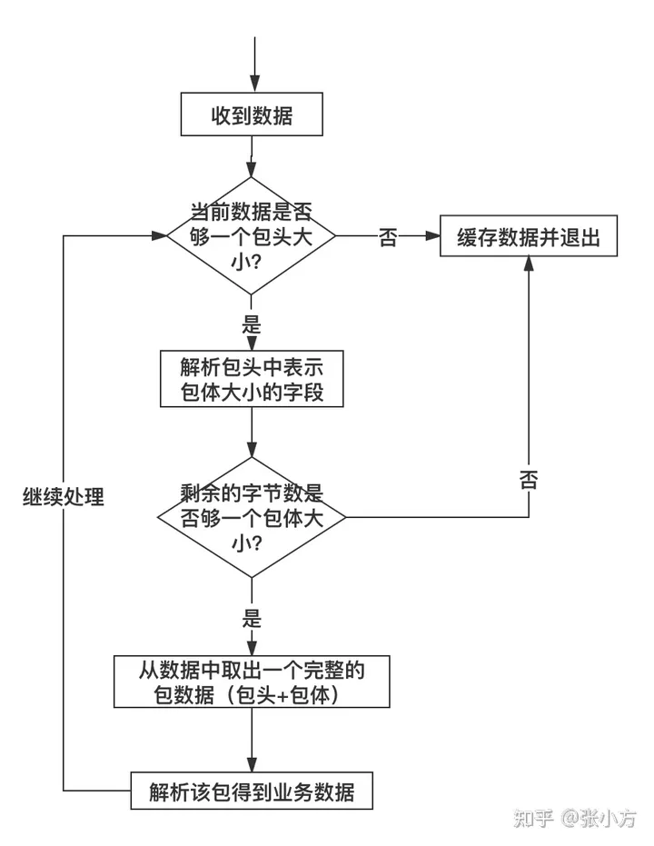

# TCP/IP五层模型和OSI七成模型

| 模型   |              |                  |                 |                 |                       |        |        |
| ------ | ------------ | ---------------- | --------------- | --------------- | --------------------- | ------ | ------ |
| TCP/IP | 物理层       | 链路层(ARP,RARP) | 网络层(ICMP,IP) | 传输层(Tcp,UDP) | 应用层(Http,DNS,PING) |        |        |
| OSI    | 物理层(网线) | 链路层(Mac)      | 网络层          | 传输层          | 会话层                | 表示层 | 应用层 |


### ARP协议

```
1.是IP地址转换成MAC地址的一种协议，当设备一联网就会广播ARP报文，可以告诉网关自己的地址，并且获取到网关的MAC地址。
2.当联网时会首先查询自己的ARP缓存，如果没有的话，会发送ARP请求，并且缓存下来。
```

1. #### ARP攻击

   ```
   1. 发送ARP包给网关，冒充劫持机的MAC地址
   2. 发送ARP包给劫持机，冒充网关MAC地址
   3. 劫持AB之间通信，分别冒充为BA
   ```

2. #### ARP防御

   ```
   ---核心为让电脑收不到欺骗包和不相信欺骗包
   1. 企业交换机支持DAI防御，当设备发出欺骗ARP时，会惩罚接口
   2. 电脑设置静态的IP与MAC直接链接
   ```


### IP协议
# TCP传输的粘包问题
#### 1. TCP协议的一些基础知识
```
1. tcp协议实际上是一个安全可靠流式传输协议，会自动解决乱序和丢包问题。
2. tcp发送的数据最好肯定会完整和有序的发送到接受端。
3. 粘包问题本质上与tcp协议无关，而是由应用层的协议栈来解决的。
```
#### 2. 什么是粘包
```
1. 假如A向B发送了一个100B和200B大小的两个数据包，但是B接受的时候可能是60B，50B，70B，110B这种任意情况，最后组成了组成了300B的包，显然第一个60B的帧，只包含了部分数据包，称为半包，第二个50B的帧，包含了部分100B的数据包和200b的数据包，这个也是半包
2. 粘包就是一个帧里面含有一个以上的完整数据包+不完整的数据包。
3. 如果不手动控制如何解析帧，那么数据会出现乱码和不完整的情况。
```

#### 3. 如何解决粘包
```
1. 固定数据包的长度：
   假设固定数据包的长度为100B，那么每次收满100B就解析，如果不够就先保存。
2. 指定数据包的结束符号
   常见的形式，即在字节流中遇到特殊的字符就认为是一个包的末尾，比如FTP和SMTP(邮件)协议都是采用的\r\n为结束符(即CRLF)
3. 包头包体格式
   其中包头是一个固定大小的数据包，其中肯定包含了包体（存放真正数据）的长度，先接受固定大小的包头（如果没有收到的话，还是先缓存）
   
```
#### 4.解包与处理
---



